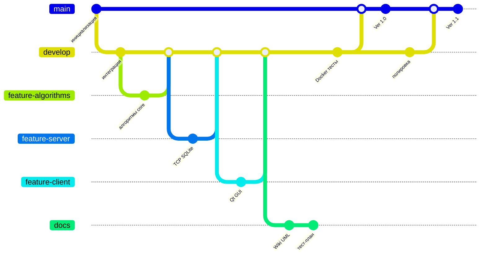
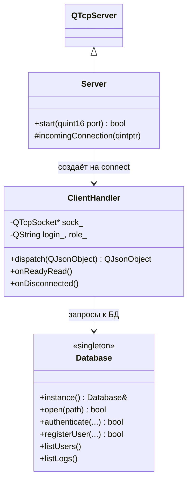
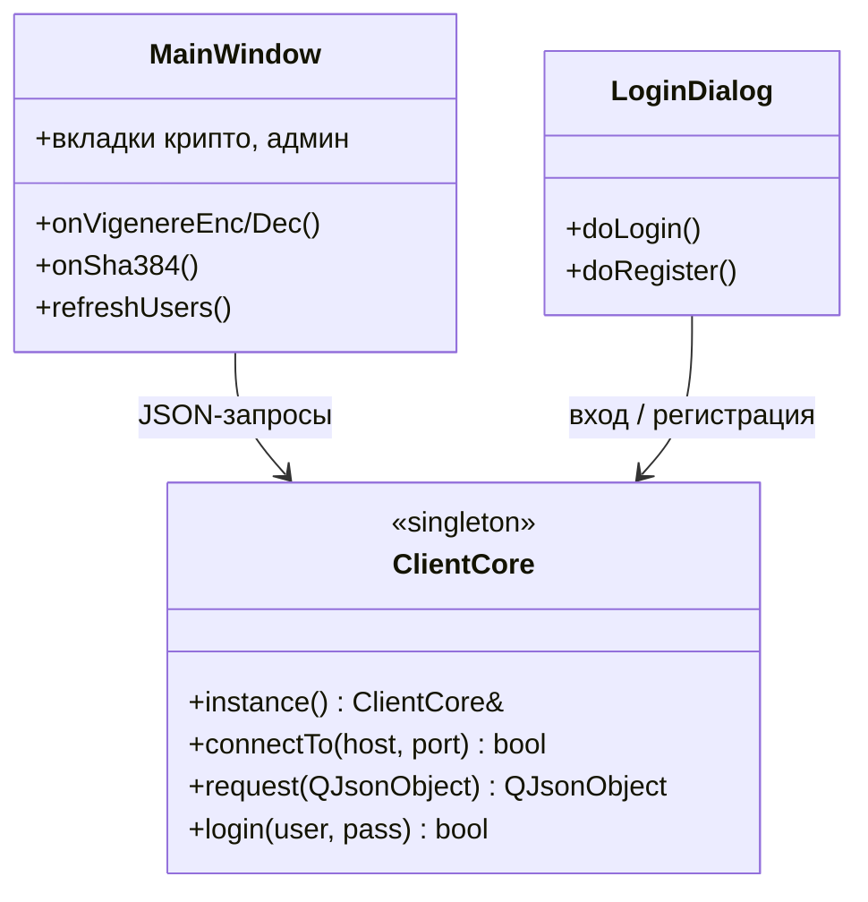
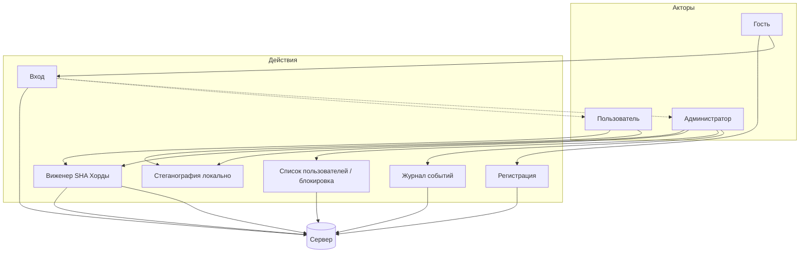
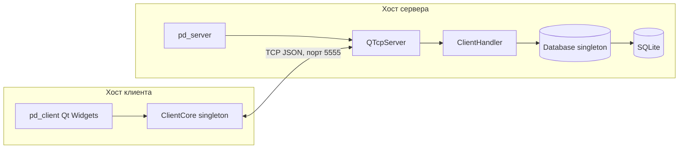

# Проект по дисциплине «Технологии и методы программирования»

**Репозиторий:** [crypto-suite-lab](https://github.com/avariceJS/crypto-suite-lab) (PD Crypto Suite)

## Участники (учебная группа: **251-353**)

1. Следников Александр  
2. Кемплинг Екатерина  

---

## Документация к проекту

| Раздел | Описание |
|--------|----------|
| [Архитектура](Architecture) | Компоненты системы, клиент–сервер |
| [Сборка и запуск](Build-and-Run) | CMake, Qt 6, Docker |
| [Протокол](Protocol) | JSON-команды TCP |
| [Роли и безопасность](Roles-and-Security) | user / admin |
| [Тестирование](Testing) | стратегия, Qt Test |
| [Стеганография](Steganography) | LSB-алгоритм |
| [Метод хорд](Chord-Method) | численное решение уравнений |
| [FAQ](FAQ) | типовые вопросы |

Файлы тест-плана и артефакты: каталог [`docs/testing`](https://github.com/avariceJS/crypto-suite-lab/tree/main/docs/testing) в основном репозитории.

---

## Структура Git (схема ветвления)

Ниже — упрощённая модель: стабильная ветка `main`, интеграция в `develop`, задачи в `feature/*`, документация в `docs`.

---

## Основные ветки

| Ветка | Назначение | Ответственные |
|-------|------------|----------------|
| `main` | Стабильный код, пригодный к сдаче / демонстрации | Следников А., Кемплинг Е. |
| `develop` | Интеграция фич и промежуточная проверка | оба участника |
| `feature/*` | Отдельные задачи (сервер, клиент, алгоритмы, Docker, тесты) | оба участника |
| `docs` | Документация, диаграммы, материалы Wiki | оба участника |

---

## Логика работы с ветками

**Проект состоит из основных частей:**

- клиент (Qt Widgets);  
- сервер (Qt TCP + SQLite);  
- общее ядро (`core`) и документация (`docs/`).

**Общий принцип:**

- актуальная документация и артефакты — в репозитории (`docs/`, при необходимости отдельная ветка `docs`);  
- разработка идёт от `develop`; прямые коммиты в `main` без ревью нежелательны;  
- задачи выполняются во временных ветках `feature/…` с последующим merge в `develop`, затем в `main` при готовности релиза.

**Этапы работы над задачей:**

1. Создать ветку `feature/<краткое-название>` от `develop`.  
2. После реализации и локальной проверки — merge (или PR) в `develop`.  
3. После проверки всего приложения — merge `develop` → `main` (релиз).  
4. При дефектах — исправления снова через `develop`.

Такая схема упрощает совместную работу и снижает риск поломки стабильной ветки.

---

## Диаграмма классов — сервер

Соответствует основным типам в коде (`server/`, `Database` — синглтон).

---

## Диаграмма классов — клиент

---

## Use-case диаграмма

---

## Стратегии тестирования

- Подробности: страница **[Тестирование](Testing)**.  
- Артефакты (чек-листы, тест-кейсы, дефекты): **[docs/testing в репозитории](https://github.com/avariceJS/crypto-suite-lab/tree/main/docs/testing)**.

---

## Прогресс в работе (примерный хронологический план)

| Период | Содержание работ |
|--------|------------------|
| Неделя 1 | Репозиторий GitHub, структура CMake, Wiki, диаграммы *(Следников А., Кемплинг Е.)* |
| Неделя 2 | Сервер: TCP, протокол JSON, SQLite-синглтон, авторизация *(Следников А., Кемплинг Е.)* |
| Неделя 3 | Клиент Qt, синглтон сетевого слоя, вкладки функций *(Следников А., Кемплинг Е.)* |
| Неделя 4 | Docker, роли admin/user, админ-таблицы, UnitTest (`tests/`) *(Следников А., Кемплинг Е.)* |
| Неделя 5 | Doxygen, тест-план и тест-кейсы, доработка документации *(Следников А., Кемплинг Е.)* |

---

## Архитектура

---

**Ответственные за Git:** Следников Александр, Кемплинг Екатерина.
